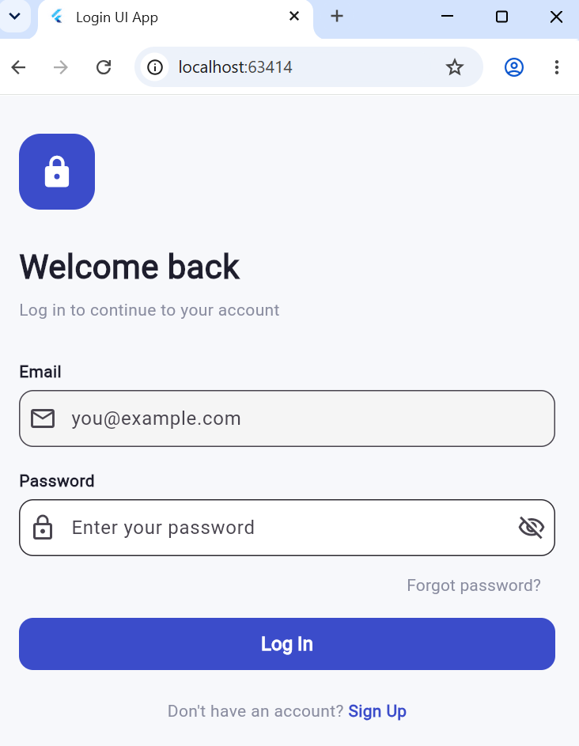
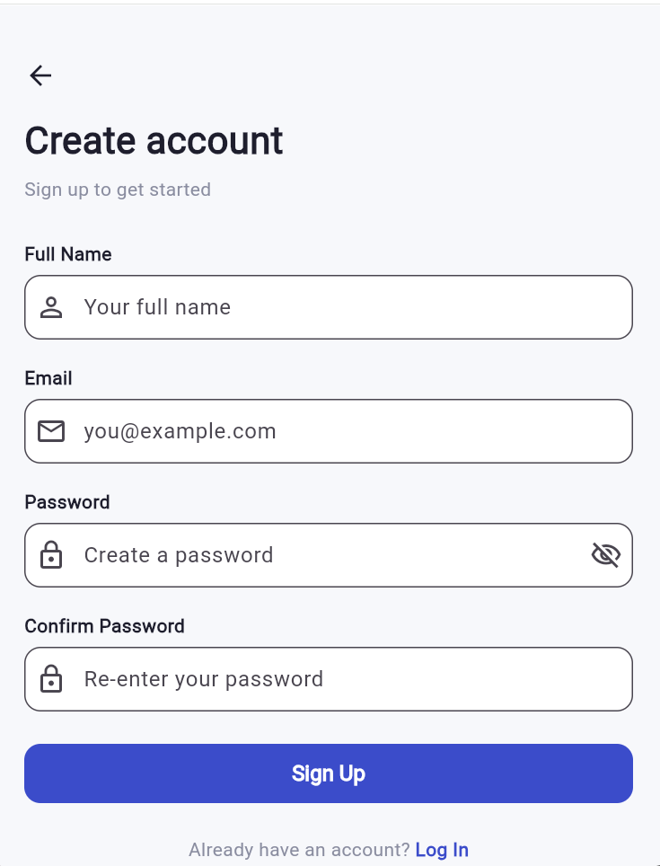
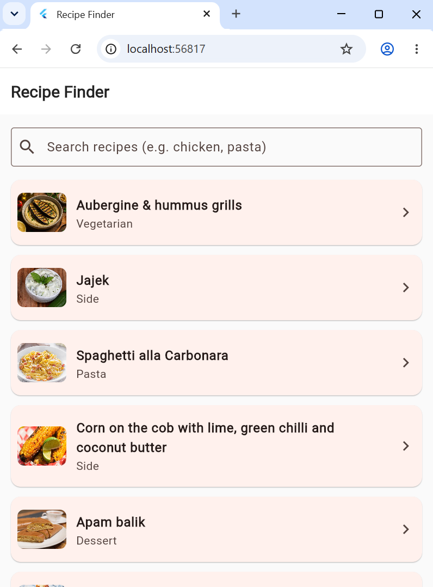
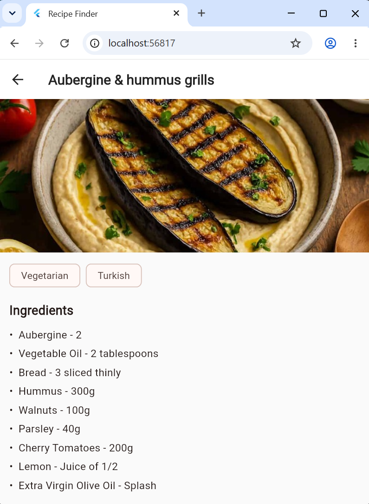

# Internship Tasks (Flutter)

This repository contains tasks completed during my flutter app development internship.

---

# Task 1: Login UI App (Flutter + Provider)

A clean, professional login and signup UI built with Flutter, made as part of an internship task. State management is handled with Provider instead of plain `setState()`, so password visibility and loading state are shared between the login and signup screens.

## Features

- Login screen with email + password fields, validation, and show/hide password
- Signup screen with name, email, password, confirm password, and validation
- Shared app state via `AuthProvider` (`ChangeNotifier`) — no duplicated state between screens

## Tech Stack

- Flutter (Dart)
- Provider

## Project Structure

lib/
main.dart
login_screen.dart
signup_screen.dart

## Getting Started

1. Add the provider package: `flutter pub add provider`
2. Get dependencies: `flutter pub get`
3. Run the app: `flutter run`

## Screenshots

| Login | Signup |
|-------|--------|
|  |  |

## How State Management Works Here

`AuthProvider` (in `main.dart`) is a `ChangeNotifier` that holds:

- `obscurePassword` — whether password fields show dots or plain text
- `isLoading` — whether the submit button should show a spinner

It's provided once at the top of the app via `ChangeNotifierProvider`, and both screens read it with `context.watch<AuthProvider>()`. Calling `notifyListeners()` inside the provider automatically rebuilds any screen that's watching it.

---

# Task 2: Recipe Finder App (Flutter + TheMealDB API)

A Flutter app that lets users search for a dish by name and fetches its recipe details — ingredients, instructions, and image — using the free TheMealDB API.

## Features

- Search a dish by name
- Fetches and displays recipe details (ingredients + instructions) from the API
- Displays the dish image returned by the API

## Tech Stack

- Flutter (Dart)
- HTTP package
- TheMealDB API

## Getting Started

1. Get dependencies: `flutter pub get`
2. Run the app: `flutter run`

## Screenshots

| Screenshot 1 | Screenshot 2 |
|--------------|--------------|
|  |  |

---
